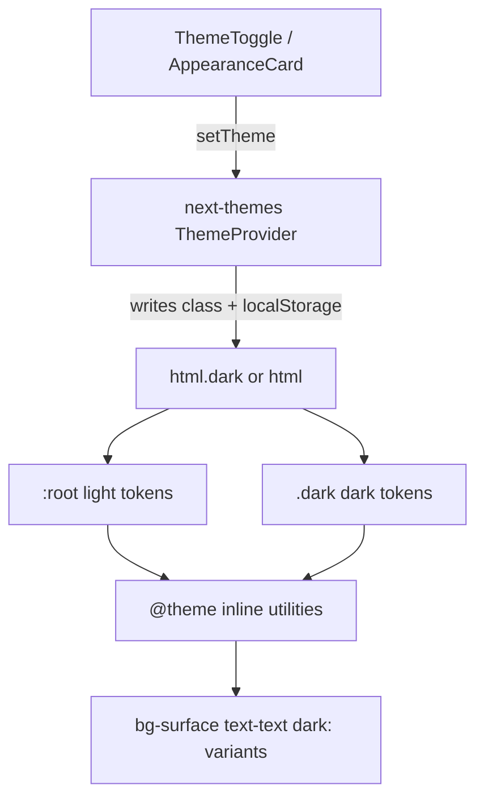

# Port Theme Switching (from this project)

Source of truth in this repo: [`src/components/providers.tsx`](src/components/providers.tsx), [`src/app/layout.tsx`](src/app/layout.tsx), [`src/app/globals.css`](src/app/globals.css), [`src/components/topbar/theme-toggle.tsx`](src/components/topbar/theme-toggle.tsx), [`src/components/profile/appearance-card.tsx`](src/components/profile/appearance-card.tsx).

This plan assumes the **same stack**: Next.js App Router + Tailwind CSS v4 + React client components. Goal: class-based dark mode with design tokens that swap when `.dark` is on `<html>`.



---

## 1. Install and wire the provider

```bash
bun add next-themes
# or: npm i next-themes
```

Create a client `Providers` wrapper (copy the pattern from this repo):

```tsx
"use client";
import { ThemeProvider } from "next-themes";

export function Providers({ children }: { children: React.ReactNode }) {
  return (
    <ThemeProvider
      attribute="class"
      defaultTheme="light"
      enableSystem={false}
      disableTransitionOnChange
    >
      {children}
    </ThemeProvider>
  );
}
```

**Config choices to keep (match this project):**
- `attribute="class"` — toggles `.dark` on `<html>` (required for the CSS below)
- `enableSystem={false}` — only explicit light/dark (no OS sync)
- `disableTransitionOnChange` — avoids flashy color transitions on switch
- `defaultTheme="light"` — first visit before localStorage exists

Wrap the tree in the **root** layout:

```tsx
<html lang="en" suppressHydrationWarning>
  <body>
    <Providers>{children}</Providers>
  </body>
</html>
```

`suppressHydrationWarning` on `<html>` is required because `next-themes` injects the class before React hydrates.

---

## 2. CSS: class-based dark + token pairs

In global CSS (Tailwind v4):

**A. Enable class-based `dark:`**

```css
@import "tailwindcss";

/* Match this repo — not media-query dark mode */
@custom-variant dark (&:is(.dark *));
```

**B. Define light tokens on `:root` and dark overrides on `.dark`**

Mirror the structure in [`src/app/globals.css`](src/app/globals.css):

```css
:root {
  --bg: #f7f8fa;
  --surface: #ffffff;
  --text: #0f1729;
  --border: #e7e9ee;
  --brand: #7c3aed;
  /* …your palette… */
  --background: var(--bg);
  --foreground: var(--text);
}

.dark {
  --bg: #0a0e16;
  --surface: #111725;
  --text: #e6e9ef;
  --border: #232c3d;
  --brand: #8b5cf6;
  /* …dark counterparts for every token… */
}
```

**C. Bridge CSS vars into Tailwind via `@theme inline`**

```css
@theme inline {
  --color-background: var(--background);
  --color-foreground: var(--foreground);
  --color-surface: var(--surface);
  --color-text: var(--text);
  --color-border: var(--border);
  --color-brand: var(--brand);
  /* one --color-* per token you want as a utility */
}
```

**D. Paint the page from tokens**

```css
@layer base {
  body {
    background-color: var(--color-background);
    color: var(--color-foreground);
  }
}
```

**Rule:** components should use semantic utilities (`bg-surface`, `text-text`, `border-border`) so they auto-adapt. Use `dark:` only for one-off cases that tokens cannot express (e.g. a special gradient).

---

## 3. Build the toggle UI

### Simple icon toggle (topbar pattern)

Copy [`theme-toggle.tsx`](src/components/topbar/theme-toggle.tsx):

- Call `setTheme(resolvedTheme === "dark" ? "light" : "dark")`
- Drive icons with CSS, not React theme state: `dark:hidden` / `dark:block` — avoids hydration flash and mount guards for the icon itself

### Explicit Light / Dark picker (profile pattern)

Copy [`appearance-card.tsx`](src/components/profile/appearance-card.tsx):

- `setTheme("light" | "dark")`
- Gate **selected** styling on a mounted check (`useSyncExternalStore` returning `false` on server / `true` on client) so SSR and first paint match

---

## 4. Theme-aware third-party widgets (optional but needed if you use them)

If you use Sonner (or similar), pass theme from `useTheme()` like [`src/components/ui/sonner.tsx`](src/components/ui/sonner.tsx):

```tsx
const { theme = "light" } = useTheme();
<Sonner theme={theme} />
```

Prefer toast chrome that uses your token classes (`bg-surface`, `text-text`) so it stays consistent even if the library theme prop is coarse.

---

## 5. Adoption checklist in the target app

1. Install `next-themes`, add `Providers` + root layout `suppressHydrationWarning`
2. Port or redefine `:root` / `.dark` token pairs + `@custom-variant dark` + `@theme inline`
3. Replace hardcoded colors (`bg-white`, `text-gray-900`) with token utilities
4. Add `ThemeToggle` (and/or appearance picker) somewhere global
5. Verify:
   - Toggle flips `<html class="dark">` in DevTools
   - Reload keeps choice (localStorage)
   - No hydration warning in console
   - Toasts / portals (if any) follow theme

---

## What not to copy blindly

- Opsole-specific color hex values — keep the **structure**, swap the palette for the other brand
- `enableSystem={false}` — keep it if you want the same UX; only change if the other product must follow OS preference (`enableSystem` + a `"system"` option)
- Always-dark marketing rails (this repo has auth rails that ignore theme) — do not put those surfaces on token backgrounds if they must stay dark
